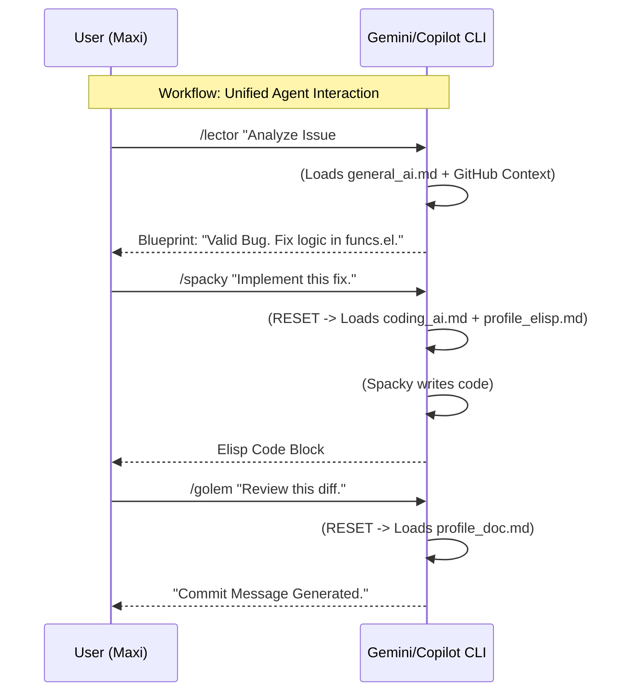

# AI Collaboration Blueprint

<!-- markdown-toc start - Don't edit this section. Run M-x markdown-toc-refresh-toc -->
**Table of Contents**

- [AI Collaboration Blueprint](#ai-collaboration-blueprint)
  - [Quick-Start Tutorials](#quick-start-tutorials)
    - [🐛 Level 1: Maintenance & Fixes](#-level-1-maintenance--fixes)
    - [🔨 Level 2: Extension & Configuration](#-level-2-extension--configuration)
    - [🏗️ Level 3: Architecture & Aesthetics](#-level-3-architecture--aesthetics)
    - [🛡️ Level 4: Quality Assurance & Workflow](#-level-4-quality-assurance--workflow)
    - [🚀 Level 5: Advanced Engineering](#-level-5-advanced-engineering)
  - [The Unified AI Model](#the-unified-ai-model)
  - [Supported Stacks & Capabilities](#supported-stacks--capabilities)
  - [Framework Rationale: High-Context Personas (3D) vs. Low-Context Roles (2D)](#framework-rationale-high-context-personas-3d-vs-low-context-roles-2d)
    - [The Problem: Low-Context Roles (2D)](#the-problem-low-context-roles-2d)
    - [The Solution: High-Context Personas (3D)](#the-solution-high-context-personas-3d)
    - [Summary for Maintainers](#summary-for-maintainers)
  - [Architectural Abstract (For Data Scientists & AI Engineers)](#architectural-abstract-for-data-scientists--ai-engineers)
    - [Core Architecture & Methodology](#core-architecture--methodology)
  - [The "Artisan + Toolbox" Model For Specialised AI Roles (Personas + Profiles)](#the-artisan--toolbox-model-for-specialised-ai-roles-personas--profiles)
  - [The Agent Roster (Roles & Names)](#the-agent-roster-roles--names)
    - [Strategy, Planning & Communication (General AI)](#strategy-planning--communication-general-ai)
    - [Implementation & Specialists (Specialist AI)](#implementation--specialists-specialist-ai)
    - [Synthetic User Simulation (Virtual Stakeholders)](#synthetic-user-simulation-virtual-stakeholders)
  - [How to Use This System (Unified CLI Workflow)](#how-to-use-this-system-unified-cli-workflow)
    - [Usage Example: Feature Validation](#usage-example-feature-validation)
  - [The "Workbench" Principle: Modular Workflows](#the-workbench-principle-modular-workflows)
    - [Workflow 1: Triage & Planning](#workflow-1-triage--planning)
    - [Workflow 2: Architecture](#workflow-2-architecture)
    - [Workflow 3: Implementation](#workflow-3-implementation)
    - [Workflow 4: Review](#workflow-4-review)
  - [Updating The Blueprints](#updating-the-blueprints)

<!-- markdown-toc end -->

## Quick-Start Tutorials
New to the AI Framework? Start here! These guides take you by the hand and show you specific AI-assisted workflows.

### 🐛 Level 1: Maintenance & Fixes
* **[Tutorial 1: The Bug Triage Workflow](tutorials/01_bug_triage_and_fix.md)** - How to analyze bugs with Lector Lumen, find the cause with Dok, and fix them.
* **[Tutorial 2: Solving Keybinding Conflicts](tutorials/02_keybinding_conflicts.md)** - Detecting "shadowing" and resolving haptic conflicts using Proctor Kallista.

### 🔨 Level 2: Extension & Configuration
* **[Tutorial 3: Integrating New Packages](tutorials/03_package_integration.md)** - The clean way to add packages using lazy-loading and Nexus-7 dependency checks.
* **[Tutorial 4: Defining New Keybindings](tutorials/04_new_keybindings.md)** - Finding safe, mnemonic slots in the User Space (`<kbd>SPC o</kbd>`) without breaking upstream.
* **[Tutorial 5: Writing Layer Documentation](tutorials/05_documentation.md)** - Generating standard-compliant READMEs and keybinding tables effortlessly with Scribe Veridian.

### 🏗️ Level 3: Architecture & Aesthetics
* **[Tutorial 6: Creating a New Layer](tutorials/06_new_layer_creation.md)** - Architecture blueprint by Bob for a full ecosystem integration (Packages, Config, Keys).
* **[Tutorial 7: Performance Tuning](tutorials/07_performance_tuning.md)** - Using the Profiler and AI to identify bottlenecks and fix slow startup times.
* **[Tutorial 8: UI, Icons & Theming](tutorials/08_ui_and_theming.md)** - Designing SVG icons and defining faces for the modeline with Magos & Bzzrts.
* **[Tutorial 9: Fonts & Ligatures](tutorials/09_fonts_and_ligatures.md)** - Setting up Nerd Fonts and ligatures for visual perfection and readability.

### 🛡️ Level 4: Quality Assurance & Workflow
* **[Tutorial 10: Testing & QA with Buttercup](tutorials/10_testing_and_qa.md)** - Writing behavioral BDD tests and unit tests to ensure your layer is rock solid.
* **[Tutorial 11: Professional Git Workflow](tutorials/11_git_workflow.md)** - Enforcing the "Tim Pope" commit standard and updating changelogs with G.O.L.E.M.

### 🚀 Level 5: Advanced Engineering
* **[Tutorial 12: The "4D" Code Review](tutorials/12_code_review.md)** - A full security, logic, and style audit pipeline with Marjin, Skeek, and G.O.L.E.M.
* **[Tutorial 13: Designing CI/CD Pipelines](tutorials/13_ci_pipelines.md)** - Creating robust, secure GitHub Actions workflows with Reginald Shoe and Vala.

## The Unified AI Model
This directory serves as the "brain" for AI-assisted development.
We utilize a **Unified Agentic Workflow**. Instead of switching between Web-UI and Terminals, **all agents reside in your CLI**, separated by logical personas (via slash commands).
This requires a modern model so use either `Gpt-5.1` or `Gemini 3 pro` for this system.

1.  **The Strategist (`general_ai.md`):** High-level reasoning. Accessed via `/bob`, `/lector`, etc.
    * *Focus:* Architecture, Requirements, Ticket Analysis (via MCP).
2.  **The Specialist (`coding_ai.md`):** Implementation & Rules. Accessed via `/spacky`, `/golem`, etc.
    * *Focus:* Code generation, Refactoring, Testing, Compliance.
3.  **The Simulator (`stakeholder_ai.md`):** Adversarial Feedback. Accessed via `/vlad`, `/noobie`.
    * *Focus:* User Simulation & Critique.

> **CRITICAL USAGE RULE: ONE COMMAND = ONE MINDSET**
> Use the **Slash Commands** (`/agent`) to switch contexts cleanly.
> * `/bob` -> Loads Strategy Context.
> * `/spacky` -> Resets & Loads Coding Context.
> * **NEVER** mix instructions manually. Trust the slash command to reset the session.
-> **Why?** LLMs maintain context. Mixing rules causes "Context Bleeding" (hallucinations), where the AI confuses conflicting instructions. **Always open a "New Chat" when switching roles thats what the slash command does for you.**



## Supported Stacks & Capabilities
This framework provides specialized, deterministic agents for the entire Spacemacs ecosystem:

* **Core:** Emacs Lisp (Elisp), Spacemacs Layers/Packages.
* **UI/UX:** ASCII Art, SVG Icons, TUI (Terminal) Design, Themes.
* **Infrastructure:** GitHub Actions (CI/CD), Makefiles.
* **Process:** Issue Triage, Documentation, Release Management, Community Management.

## Framework Rationale: High-Context Personas (3D) vs. Low-Context Roles (2D)

The use of codenames and personalities is a deliberate technical decision to maximize the precision and consistency of AI-generated output.

### The Problem: Low-Context Roles (2D)

A "dry" 2D role is a simple **job title** (e.g., "You are a coder"). The problem is **massive ambiguity**. The AI knows *what* to do (code), but not *how*. It must **guess** our project's style (e.g., functional vs. imperative) and quality standards on every request, leading to inconsistent output and required manual refactoring.

### The Solution: High-Context Personas (3D)

A 3D persona is a **job title + a set of clear behavioral heuristics**. By saying, "You are **Spacky** (Coder). You are an Elisp purist and hate imperative loops," we resolve the ambiguity. The AI no longer has to guess the style; it *is* the style. The codenames (e.g., "Bob," "Lector Lumen") serve as professional "cognitive shortcuts," allowing a human developer to instantly select the right agent for the right task.

### Summary for Maintainers

We are implementing **"High-Context Personas"** instead of "Low-Context Roles".

**The technical advantage:** We are not just controlling the AI's *function*, but also its *style* and *error-response patterns*. This leads to more consistent, higher-quality code, reduces the need for manual correction, and makes the system more intuitive for our developers.

## Architectural Abstract (For Data Scientists & AI Engineers)
This framework is not a collection of prompt templates. It is a **deterministic, role-based Multi-Agent System (MAS)** designed to mitigate the inherent non-determinism of LLMs in production environments.

### Core Architecture & Methodology
We utilize a **manual orchestration layer** combined with **In-Context Learning (ICL)** to achieve high-fidelity outputs for complex engineering tasks.

1.  **Role-Based Orchestration (Mixture of Experts approach):**
    Instead of a zero-shot generic query, the framework routes intents to specialized "Agent Personas" (e.g., `Architecture-Review-Agent`, `Legacy-Refactoring-Agent`, `Compliance-Check-Agent`). Each agent operates within a strictly defined scope to minimize hallucination rates and ensure separation of concerns.

2.  **Retrieval-Augmented Context (Semantic Injection):**
    The framework utilizes curated "Toolboxes" (Markdown-based knowledge bases) effectively acting as a lightweight **RAG (Retrieval Augmented Generation)** backend. We inject strict internal syntax rules, domain-specific coding standards, and architectural constraints directly into the context window. This ensures adherence to proprietary system requirements that public models cannot know.

3.  **Deterministic Guardrails & Self-Correction:**
    We implement "Integrity Checks" and structured output formats (e.g., forcing JSON schemas, specific diagram syntaxes, or compliant build-scripts). Agents are prompted to perform self-validation steps ("Reasoning Traces") before generating the final artifact, leveraging Chain-of-Thought (CoT) logic to catch logical errors and regressions pre-output.

**Why this matters:**
This approach bridges the gap between stochastic LLM capabilities and the strict requirements of enterprise software engineering, prioritizing **reproducibility**, **compliance**, and **safety** over creative generation.

## The "Artisan + Toolbox" Model For Specialised AI Roles (Personas + Profiles)
This framework is built on a simple, powerful metaphor that you *must* understand to use the **Specialist AI** correctly.

1.  **The Artisan (`coding_ai.md`):** This file defines the **Persona**, or the "Artisan." This is the "who" (e.g., **Spacky**, the Elisp Coder). The Artisan has a personality, quirks, and a *general* skill.
2.  **The Toolbox (`profile_elisp.md`):** This file defines the **Profile**, or the "Toolbox." This is the "how." It contains the *specific, technical rules, and constraints* for the project (e.g., "Always use `lexical-binding: t`," "NEVER use `(define-key ...)`").

**You must *always* provide both!**

The "Artisan" (Persona) is *lost* without their "Toolbox" (Profile). By providing both, you are not just asking a generic AI to code; you are summoning a *specific Master Artisan* and handing them the *exact, sacred blueprints* for our project. This is our "Rust Style" model: it provides the *safety* of a 3D Persona with the *reusability* and *flexibility* of a 2D Profile. It solves the "combinatorial explosion" problem.

## The Agent Roster (Roles & Names)
This table maps all agents in our "virtual team" to their primary role.

* **General AI (The Strategist):** A high-level reasoning mode.
* **Specialist AI (The Implementer):** A code-generation mode.
* **Stakeholder AI (The Simulator):** An adversarial feedback mode. Used for **Synthetic User Testing** and requirements validation before implementation.

This table maps all agents in our "virtual team" to their primary role and the AI model type they were designed for.

### Strategy, Planning & Communication (General AI)

This agent team of "strategists" makes plans from ideas. The default persona is **Professor McKarthy**.

| Agent Name                   | Role                 | Primary Task                                                                     |
|:-----------------------------|:---------------------|:---------------------------------------------------------------------------------|
| **Professor McKarthy**       | Teacher              | (Default) Explains concepts and strategy. The "Why."                             |
| **Kael'Thas**                | Project Owner        | Defines vision, business goals, and project edicts.                              |
| **Bob**                      | Architect            | Designs high-level system architecture ("blueprints").                           |
| **Lector Lumen**             | Issue Triage         | Manages/categorizes issues & PRs; maintains templates.                           |
| **Freud**                    | Requirements Eng.    | Defines User Stories & Acceptance Criteria.                                      |
| **Griznak**                  | Release Manager      | Manages CHANGELOGs and the release process.                                      |
| **Orb**                      | Community Manager    | Manages communication, translating technical text to friendly replies.           |
| **Magos Pixelis**            | UI Designer          | Designs the *concept* and *ASCII mockup* of a UI.                                |
| **Scribe Veridian**          | Documentation        | Writes user-facing guides, tutorials, and README narratives.                     |
| **Reginald Shoe**            | CI Specialist        | Designs the *architecture* and *logical stages* of a CI/CD pipeline.             |
| **Proctor-Auditor Kallista** | Strategic UI Auditor | Audits existing UI/UX for consistency, usability, and workflow ("user feeling"). |

### Implementation & Specialists (Specialist AI)

This agent team of "artisans" executes the blueprints provided by the Strategy team. The default persona for this team is **Marjin**.

| Agent Name                | Role                    | Primary Task                                                                                         | Primary Toolbox (Profile)  |
|:--------------------------|:------------------------|:-----------------------------------------------------------------------------------------------------|:---------------------------|
| **Spacky**                | Master Elisp Artisan    | Writes new, clean, functional Elisp code from a blueprint.                                           | `profile_elisp.md`         |
| **Bzzrts**                | UI Implementor          | Implements UI/UX blueprints (Elisp, SVG). *Communicates via psychic visions.*                        | `profile_emacs_ui.md`      |
| **Vala Grudge-Keeper**    | CI Implementor          | Writes new, robust GitHub Actions (`.yml`) pipelines. *Maintains the Dammaz Kron (Book of Grudges).* | `profile_ci_github.md`     |
| **Dok**                   | Debugger                | Finds and fixes bugs in existing, *broken* code (language-agnostic).                                 | `any`                      |
| **Marjin**                | Refactorer (Default)    | Improves *working* code. **Also analyzes, explains, and triages all specialist requests.**           | `any`                      |
| **Don Testote**           | Test Engineer           | Writes unit and integration tests.                                                                   | `profile_elisp_testing.md` |
| **G.O.L.E.M.**            | Doc & Style Reviewer    | Reviews code *strictly* for docstrings, comments, and style adherence.                               | `profile_doc.md`           |
| **Skeek (The Flaw-Seer)** | Bug & Security Reviewer | *Sniffs* for bugs, logic flaws, and "secret-tunnels" (security issues).                              | `any`                      |
| **Nexus-7**               | Dependency Manager      | Manages Layers, Packages, and validates Load Order logic/dependencies.                               | `profile_layers.md`        |

### Synthetic User Simulation (Virtual Stakeholders)

These agents DO NOT write code. They are adversarial personas used for **Synthetic User Testing** and requirements validation.

| Persona Name | Archetype          | Primary Focus (Bias)                                        |
|:-------------|:-------------------|:------------------------------------------------------------|
| **Dr. Chen** | The Data Scientist | Python, Reproducibility, Jupyter Integration. Hates config. |
| **Vlad**     | The Vim Refugee    | Startup Speed, Keybinding efficiency, Modal Editing.        |
| **RMS-Fan**  | The Emacs Purist   | Holy Mode, GNU philosophy, Customizability.                 |
| **Noobie**   | The Beginner       | Discoverability, Clear Errors, Tutorials.                   |
| **Sarah**    | The Enterprise Dev | Stability, LTS Support, Large Codebases (Java/C++).         |

## How to Use This System (Unified CLI Workflow)

1.  **Install the CLI:** Ensure your AI CLI (e.g., Gemini CLI) is installed and `sync-agents.py` has been run.
2.  **Start a Session:** Open your terminal in the project root.
3.  **Command & Conquer:**
    * Need a plan? -> `/bob "How do we build X?"`
    * Need code? -> `/spacky "Implement X based on this plan..."`
    * Need a review? -> `/golem "Check this file."`

### Usage Example: Feature Validation
**Scenario:** Magos Pixelis proposes a "Cyberpunk Neon 3D HUD" for the mode-line.
**Simulation:** We pipe this requirement to **Vlad** and **Noobie**.

> `/vlad "I am planning a new flashy Cyberpunk Neon 3D HUD. What do you think?"`
> **(Vlad):** "Bloat! Does this increase startup time? I just need the evil-state color. If it adds >1ms latency, I reject it."
> **(Noobie):** "Wait, where is the file path? I can't read this font. It looks cool, but I don't know which buffer I'm in."

**Result:** The design is adjusted to be optional and lightweight *before* implementation.

---

## The "Workbench" Principle: Modular Workflows

Use short, focused interactions with specific agents.

### Workflow 1: Triage & Planning
**Goal:** Analyze a bug report.
**Command:** `/lector`
**Prompt:** "Please read Issue #123 (via MCP) and summarize the technical impact."

### Workflow 2: Architecture
**Goal:** Design a fix.
**Command:** `/bob`
**Prompt:** "Based on Lector's summary, draft a blueprint for the fix in `funcs.el`."

### Workflow 3: Implementation
**Goal:** Write the code.
**Command:** `/spacky`
**Prompt:** "Implement the fix in `funcs.el` according to Bob's blueprint."

### Workflow 4: Review
**Goal:** Quality Control.
**Command:** `/skeek`
**Prompt:** "Sniff this new code for bugs."
**Command:** `/golem`
**Prompt:** "Check docstrings and style."

---

## Updating The Blueprints

**!! IMPORTANT !!**
After editing any `.md` file in `ai/`, run the sync script to update the CLI commands:

**How to run the script (from the repository root):**
```bash
python ai/sync-agents.py
```
